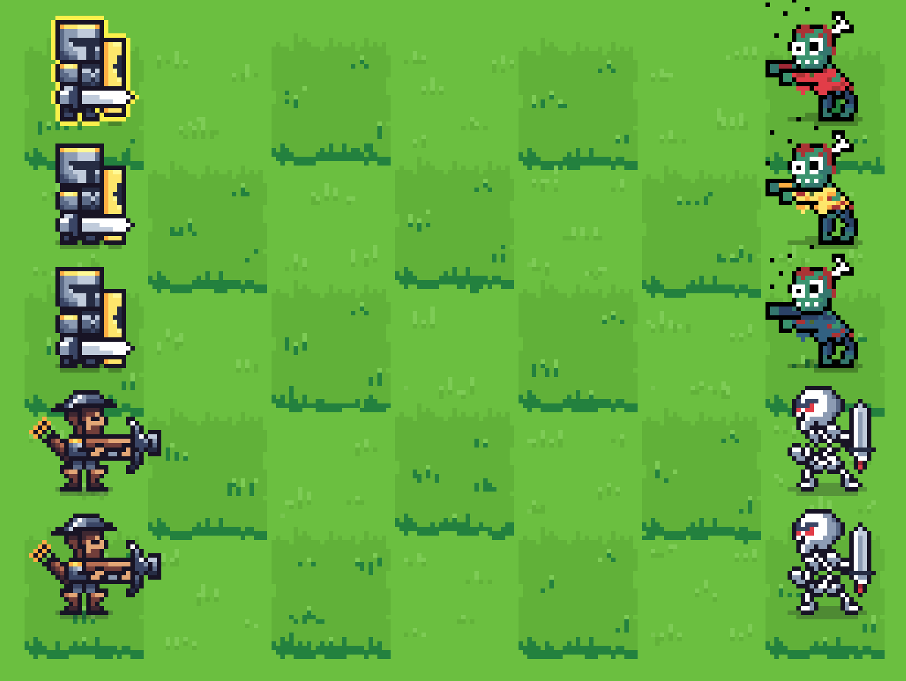

# Heroes

A turn-based tactical game in ClojureScript, DataScript and Rum.

## Development

To get an interactive development environment run:

    ./repl.sh

To clean all compiled files:

    ./clean.sh

To create a production build run:

    ./min.sh

## License

Copyright © 2019 Nikita Prokopov

Distributed under the MIT License.
